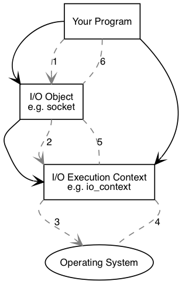
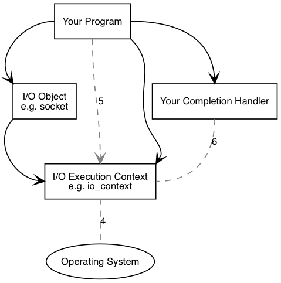

- [asio的官网](https://think-async.com/Asio/)
- [Asio-nonboost 文档](https://think-async.com/Asio/asio-1.18.2/doc/)


## 基础asio的解剖 [Basic Asio Anatomy](https://think-async.com/Asio/asio-1.18.2/doc/asio/overview/core/basics.html)




asio有两种使用方式：synchronous，asynchronous

程序必须有一个**I/O execution context**

**I/O Object**
**Asio::error_code ec**


异步的程序





执行的过程:

1. 调用**I/O Object**的里的一个异步的函数，这个函数带有一个 **completion Handler**,如下
    ```c++
    void your_completion_Handler(const asio::error_code &ec)
    socket.async_connect(server_point,your_completion_Handler);
    ```
2.  **I/O Object**转发请求给**I/O execution context**
3. **I/O execution context**发送信号给操作系统，告诉它应该发起一个`async_connect`
4. 操作系统执行完后，把结果放入到一个队列里，队列里的结果准备被**I/O execution context**取走
5. 如果你使用`io_context`作为**I/O execution context**,你的程序必须使用`io_context::run()`(或使用其它的类似`io_context`成员函数) 来收集上一步产生的结果，一旦执行`io_context::run()`就会阻塞，当有这里有末完成的异步方法。
6. 执行了`io_context::run`,**I/O execution context**使用队列管理方法的结果，把结果转换成一个`error_code`,然后把`error_code`传入`your_completion_Handler`

## 基于事件的驱动的编程模型

 - reactor
  - lighttpd
  - libevent
  - libev
  - poco
 - proactor
   - asio
   - locp

[The Proactor Design Pattern: Concurrency Without Threads](https://think-async.com/Asio/asio-1.18.2/doc/asio/overview/core/async.html)


